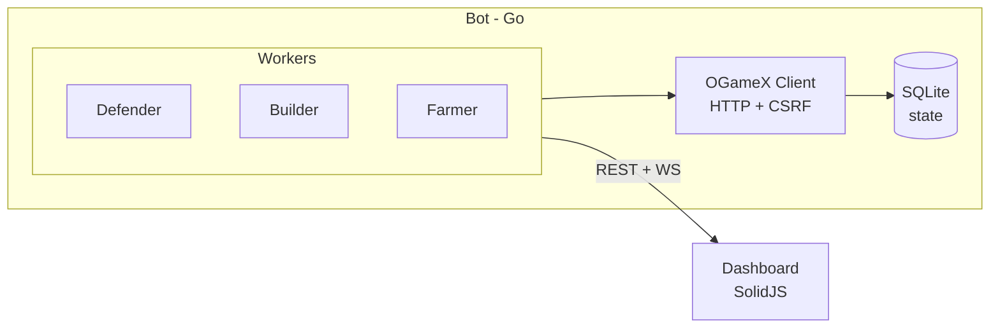

# OGameX Bot

[](https://go.dev/)
[](LICENSE)
[](https://solidjs.com/)
[](https://sqlite.org/)

Open-source OGame automation bot targeting [OGameX](https://github.com/lanedirt/OGameX) — an open-source OGame clone. Handles fleet safety, auto-building, auto-farming, and provides a web dashboard for monitoring. Runs as a single Go binary on Windows.

## Features

- **Fleet Safety** — Detects incoming attacks and auto-saves your fleet with phalanx-safe deploy + recall
- **Auto-Build** — ROI-based building upgrades across all planets, respects max-level caps
- **Auto-Farm** — Scans galaxy for inactive players, spies them, attacks when profitable
- **Web Dashboard** — Real-time empire overview with WebSocket updates, fleet movements, build/activity logs
- **Anti-Detection** — Randomized request intervals, jitter on all actions, configurable rate limiting
- **Zero-Ops** — SQLite database, single Go binary, no Docker needed

## Quick Start

### Prerequisites

- [Go 1.22+](https://go.dev/dl/)
- An OGameX account (e.g., at [main.ogamex.dev](https://main.ogamex.dev))

### 1. Configure

```bash
cp config.example.yaml config.yaml
```

Edit `config.yaml` with your OGameX credentials and enable features:

```yaml
ogamex:
  url: "https://main.ogamex.dev"
  email: "your@email.com"
  password: "your_password"

features:
  defender:
    enabled: true
    pollIntervalMs: 30000
    recallEnabled: true
  autoBuild:
    enabled: true
    pollIntervalMs: 120000
  autoFarm:
    enabled: true
    pollIntervalMs: 300000
```

Secrets can be loaded from environment variables via `${ENV_VAR}` interpolation:

```bash
export OGAMEX_EMAIL="your@email.com"
export OGAMEX_PASSWORD="your_password"
```

### 2. Run

```bash
go run ./cmd/bot
```

### 3. Monitor

Open http://localhost:3000 for the web dashboard.

### 4. Build Binary

```bash
go build -o bot.exe ./cmd/bot
./bot.exe
```

## Architecture



- **OGameX Client** — Go HTTP client with Laravel session auth, CSRF token management, HTML/JSON parsing via goquery
- **Workers** — Defender (fleet-save), Builder (ROI upgrades), Farmer (galaxy scan + attack)
- **Dashboard** — SolidJS SPA with real-time WebSocket updates

## Project Structure

```
cmd/bot/main.go              Entrypoint
internal/
  config/                    YAML config loader with env interpolation
  constants/                 OGame building/ship/mission IDs
  model/                     Domain types
  ogamex/                    OGameX HTTP client (session auth + CSRF)
    client.go                Client struct + interface satisfaction
    session.go               Login/Logout with CSRF extraction
    transport.go             HTTP helpers (doGet, doPost, doAJAX)
    parser.go                HTML/JSON parsing (goquery)
    planets.go               Planet/resource/building queries
    fleet.go                 Fleet event queries
    fleet_dispatch.go        SendFleet + CancelFleet
    build.go                 BuildBuilding
    galaxy.go                Galaxy scan
    espionage.go             Espionage reports
    global.go                Research, constructions, server info
  state/                     SQLite database + game state cache
  defender/                  Fleet safety worker + escape route calculator
  builder/                   Auto-build worker + ROI calculator
  farmer/                    Auto-farm worker (scan/spy/attack)
  dashboard/                 REST API + WebSocket hub
packages/
  dashboard/                 SolidJS web frontend
```

## Configuration

All settings live in `config.yaml`. Secrets can use `${ENV_VAR}` interpolation.

| Setting | Default | Description |
|---------|---------|-------------|
| `ogamex.url` | — | OGameX server URL (required for OGameX mode) |
| `ogamex.email` | — | OGameX account email |
| `ogamex.password` | — | OGameX account password |
| `features.defender.enabled` | `false` | Enable fleet-save on attack detection |
| `features.defender.recallEnabled` | `true` | Auto-recall fleet after attack passes |
| `features.defender.safetyMarginMs` | `120000` | Min time before attack to trigger save |
| `features.autoBuild.enabled` | `false` | Enable ROI-based building upgrades |
| `features.autoFarm.enabled` | `false` | Enable inactive player farming |
| `dashboard.enabled` | `true` | Enable web dashboard |
| `dashboard.port` | `3000` | Dashboard HTTP port |

## Development

### Run tests

```bash
go test ./...
```

### Build dashboard

The SolidJS dashboard must be built before the Go binary so static files get embedded:

```bash
pnpm install
pnpm --filter @ogame-bot/dashboard build
```

This outputs to `internal/dashboard/static/` which the Go binary embeds.

### Build bot

```bash
go build -o bot.exe ./cmd/bot
```

### Dev with hot-reload dashboard

```bash
# Terminal 1: Go bot
go run ./cmd/bot

# Terminal 2: Vite dev server (proxies API/WS to :3000)
pnpm --filter @ogame-bot/dashboard dev
# Open http://localhost:5173
```

## License

MIT
