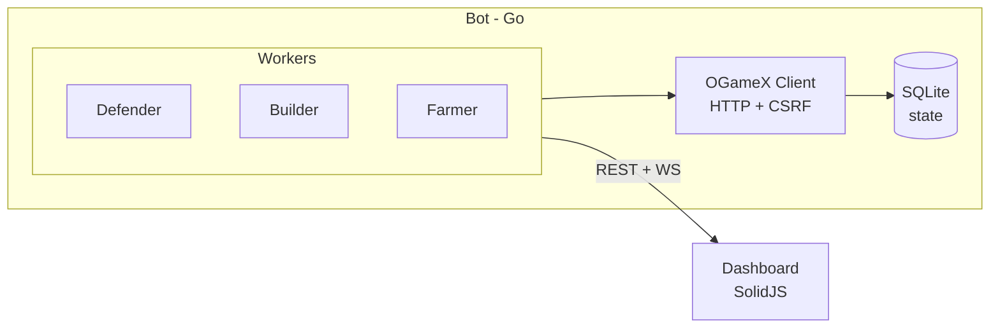

# OGameX Bot

[](https://go.dev/)
[](LICENSE)
[](https://solidjs.com/)
[](https://sqlite.org/)

Open-source OGame automation bot targeting [OGameX](https://github.com/lanedirt/OGameX) — an open-source OGame clone. Handles fleet safety, auto-building, auto-farming, and provides a web dashboard for monitoring. Runs as a single Go binary on Windows.

## Features

- **Fleet Safety** — Detects incoming attacks and auto-saves your fleet with phalanx-safe deploy + recall
- **Auto-Build** — ROI-based building upgrades across all planets, respects max-level caps
- **Auto-Farm** — Scans galaxy for inactive players, spies them, attacks when profitable
- **Web Dashboard** — Real-time empire overview with WebSocket updates, fleet movements, build/activity logs
- **Anti-Detection** — Randomized request intervals, jitter on all actions, configurable rate limiting
- **Zero-Ops** — SQLite database, single Go binary, no Docker needed

## Quick Start

### Prerequisites

- [Go 1.22+](https://go.dev/dl/)
- An OGameX account (e.g., at [main.ogamex.dev](https://main.ogamex.dev))

### 1. Configure

```bash
cp config.example.yaml config.yaml
```

Edit `config.yaml` with your OGameX credentials and enable features:

```yaml
ogamex:
  url: "https://main.ogamex.dev"
  email: "your@email.com"
  password: "your_password"

features:
  defender:
    enabled: true
    pollIntervalMs: 30000
    recallEnabled: true
  autoBuild:
    enabled: true
    pollIntervalMs: 120000
  autoFarm:
    enabled: true
    pollIntervalMs: 300000
```

Secrets can be loaded from environment variables via `${ENV_VAR}` interpolation:

```bash
export OGAMEX_EMAIL="your@email.com"
export OGAMEX_PASSWORD="your_password"
```

### 2. Run

```bash
go run ./cmd/bot
```

### 3. Monitor

Open http://localhost:3000 for the web dashboard.

### 4. Build Binary

```bash
go build -o bot.exe ./cmd/bot
./bot.exe
```

## Architecture



- **OGameX Client** — Go HTTP client with Laravel session auth, CSRF token management, HTML/JSON parsing via goquery
- **Workers** — Defender (fleet-save), Builder (ROI upgrades), Farmer (galaxy scan + attack)
- **Dashboard** — SolidJS SPA with real-time WebSocket updates

## Project Structure

```
cmd/bot/main.go              Entrypoint
internal/
  config/                    YAML config loader with env interpolation
  constants/                 OGame building/ship/mission IDs
  model/                     Domain types
  ogamex/                    OGameX HTTP client (session auth + CSRF)
    client.go                Client struct + interface satisfaction
    session.go               Login/Logout with CSRF extraction
    transport.go             HTTP helpers (doGet, doPost, doAJAX)
    parser.go                HTML/JSON parsing (goquery)
    planets.go               Planet/resource/building queries
    fleet.go                 Fleet event queries
    fleet_dispatch.go        SendFleet + CancelFleet
    build.go                 BuildBuilding
    galaxy.go                Galaxy scan
    espionage.go             Espionage reports
    global.go                Research, constructions, server info
  state/                     SQLite database + game state cache
  defender/                  Fleet safety worker + escape route calculator
  builder/                   Auto-build worker + ROI calculator
  farmer/                    Auto-farm worker (scan/spy/attack)
  colonizer/                 Auto-colonize worker (galaxy scan + dispatch)
  dashboard/                 REST API + WebSocket hub
packages/
  dashboard/                 SolidJS web frontend
```

## How It Works

### State Manager

The state manager is the central cache. Every 60 seconds it:

1. Fetches planet list from OGameX
2. For each planet, fetches resources, buildings, facilities, and planet details (fields, temperature)
3. Fetches global data: research levels, fleet movements, fleet slots, server speed
4. Writes everything to SQLite

All workers read from this cached state instead of hitting OGameX directly. Workers can force a refresh before critical actions (e.g., builder fetches live resources before spending).

### Defender (Fleet Safety)

The defender protects your fleet from incoming attacks:

1. **Detect** — Polls for hostile fleet events (mission type 1 = attack). If any attack is arriving within the safety margin (default 2 minutes), the endangered planet is flagged.
2. **Save** — Loads all ships and resources from the endangered planet, calculates a safe deployment destination (own planet, different coords), and sends the fleet on a deploy mission.
3. **Recall** — After the attack passes, the defender recalls the deployed fleet so it returns home. Deploy-with-recall is phalanx-safe (the recall is invisible to sensor phalanx scans).
4. **Random delay** — Adds a random reaction delay (30-120s) to avoid bot-like instant responses.

All fleet-save events are tracked in the `fleet_save_events` SQLite table.

### Builder (Auto-Build)

The builder upgrades buildings and research using a tiered priority system:

1. **Energy** — If any planet has negative energy, builds Solar Plant or Fusion Reactor first
2. **Mines** — Calculates ROI score for Metal Mine, Crystal Mine, Deuterium Synthesizer upgrades on every planet. ROI = production gain / resource cost. Picks the highest-ROI upgrade across all planets.
3. **Infrastructure** — Builds in fixed order: Research Lab → Robotics Factory → Shipyard → Nanite Factory (skips already-maxed or prerequisites-not-met)
4. **Research** — Starts the next research from a configurable priority list on the planet with the highest-level Research Lab
5. **Storage** — Builds storage when a resource exceeds 80% capacity

Before executing any build, the builder fetches **live resources** from OGameX (not cached) to prevent double-spending. A `spent` map tracks resources committed in the same poll cycle across multiple tiers.

Max level caps are configurable globally and per-planet via `maxLevels` and `planetOverrides`.

### Farmer (Auto-Farm)

The farmer finds and attacks inactive players for resources:

1. **Scan** — Scans configured galaxy ranges for inactive players
2. **Spy** — Sends espionage probes to inactive targets
3. **Evaluate** — Parses espionage reports for total lootable resources. Attacks only if profit exceeds `minProfitThreshold` (default 10,000 metal-equivalent)
4. **Attack** — Sends small/large cargo ships with the minimum needed capacity

Respects fleet slot limits, skips defended targets when configured, and limits attacks per cycle.

### Colonizer (Auto-Colonize)

The colonizer expands your empire automatically:

1. **Check** — Compares current planet count against `targetPlanetCount` and the Astrophysics tech limit (max colonies = 1 + Astrophysics level)
2. **Scan** — Scans systems around your home planet for empty positions
3. **Score** — Ranks empty positions by preference (positions 4-8 have the most fields, 1-3 and 9-15 have fewer)
4. **Dispatch** — Finds a planet with a Colony Ship and sends it on a colonize mission (mission 7)

Requires: Colony Ship built on one of your planets (Shipyard 4 + Impulse Drive 3). The builder does not yet auto-build ships.

### OGameX Client

The client handles all communication with OGameX:

- **Session auth** — Logs in via Laravel Fortify, maintains session cookies
- **CSRF tokens** — Extracts from `<meta name="csrf-token">`, auto-refreshes from `newAjaxToken` in JSON responses
- **Rate limiting** — Configurable min/max delay between requests (default 2-5 seconds)
- **Re-auth** — Automatically re-authenticates on 401/session expiry
- **HTML parsing** — Uses goquery to extract game data from OGameX pages (no JSON API for most game state)
- **Fleet dispatch** — Two-step: check-target → send-fleet, with CSRF token in both requests

### Dashboard

The SolidJS dashboard connects to the bot via REST + WebSocket:

- **REST API** — `/api/planets`, `/api/resources`, `/api/buildings`, `/api/research`, `/api/build-events`, `/api/fleet-save-events`, `/api/farm-attacks`, `/api/build-plan`
- **WebSocket** — `/ws` pushes real-time events: build completions, research starts, fleet-save actions, farm attacks, colonization attempts
- **Static files** — The dashboard is built into `internal/dashboard/static/` and embedded in the Go binary via `embed.FS`

## Configuration

All settings live in `config.yaml`. Secrets can use `${ENV_VAR}` interpolation.

| Setting | Default | Description |
|---------|---------|-------------|
| `ogamex.url` | — | OGameX server URL (required for OGameX mode) |
| `ogamex.email` | — | OGameX account email |
| `ogamex.password` | — | OGameX account password |
| `features.defender.enabled` | `false` | Enable fleet-save on attack detection |
| `features.defender.recallEnabled` | `true` | Auto-recall fleet after attack passes |
| `features.defender.safetyMarginMs` | `120000` | Min time before attack to trigger save |
| `features.autoBuild.enabled` | `false` | Enable ROI-based building upgrades |
| `features.autoFarm.enabled` | `false` | Enable inactive player farming |
| `features.colonizer.enabled` | `false` | Enable auto-colonization |
| `features.colonizer.targetPlanetCount` | `8` | Total planets to colonize |
| `features.colonizer.preferPositions` | `[4,5,6,7,8]` | Preferred planet positions (most fields) |
| `features.colonizer.scanRadius` | `50` | Systems to scan around home planet |
| `dashboard.enabled` | `true` | Enable web dashboard |
| `dashboard.port` | `3000` | Dashboard HTTP port |

## Development

### Run tests

```bash
go test ./...
```

### Build dashboard

The SolidJS dashboard must be built before the Go binary so static files get embedded:

```bash
pnpm install
pnpm --filter @ogame-bot/dashboard build
```

This outputs to `internal/dashboard/static/` which the Go binary embeds.

### Build bot

```bash
go build -o bot.exe ./cmd/bot
```

### Dev with hot-reload dashboard

```bash
# Terminal 1: Go bot
go run ./cmd/bot

# Terminal 2: Vite dev server (proxies API/WS to :3000)
pnpm --filter @ogame-bot/dashboard dev
# Open http://localhost:5173
```

## License

MIT
